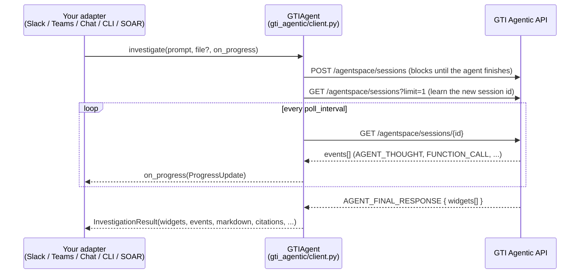

# gti-agentic

A minimal, opinion-free Python client for the **Google Threat Intelligence Agentic API**
(`https://www.virustotal.com/api/v3/agentspace`).

It does exactly one thing: send a prompt (and optional file) to the GTI agent, stream progress
while it works, and hand you back the agent's final response **as the API returned it**.

Everything else — your prompt policy, your SIEM's query language, your detection-rule format,
how reports look, which chat platform you use — is yours to decide and lives in *your* adapter,
not in this package.

```
pip install httpx
pip install -e .          # or copy gti_agentic/client.py into your project — it's one file
```

## 30-second example

```python
import asyncio
from gti_agentic import GTIAgent

async def main():
    agent = GTIAgent(api_key="...")            # or set VT_API_KEY
    result = await agent.investigate(
        "Summarise APT29 activity in the last 90 days",
        on_progress=lambda u: print(f"[{u.elapsed_seconds:.0f}s] {u.kind}: {u.detail}"),
    )
    print(result.markdown)

asyncio.run(main())
```

```
export VT_API_KEY=...
python -m examples.cli "Deobfuscate this and explain it" --file sample.ps1
python -m examples.cli "What is Akira ransomware?" --raw        # dump the widgets as JSON
```

## How it works



The POST blocks for the lifetime of the investigation (often minutes). To give users live feedback
the client runs it in the background and polls the session for events in the meantime. That is the
whole trick; there is no SSE and no second LLM.

## What you get back

```python
result.status            # "COMPLETED" | "FAILED" | "TIMEOUT"
result.ok                # status == "COMPLETED"
result.session_id        # reuse via investigate(..., session_id=...) for follow-up questions
result.widgets           # list[dict] — final-response widgets, verbatim from the API
result.markdown          # all MARKDOWN_TEXT widgets joined; nothing stripped or rewritten
result.citations         # gti_citations from the markdown widgets (collections, actors, reports)
result.widgets_of_type("GRAPH")   # also "CODE", "RULE", "MITRE_ATTACK", "MARKDOWN_TEXT"
result.events            # the full raw session event log
result.tools_executed    # names from FUNCTION_CALL events
result.error             # populated on FAILED / TIMEOUT
```

Widget types and the key that holds their payload. Run `examples/cli.py --raw` to see exactly what
your prompt produced — the set varies by question.

| `widget_type`   | payload key            | notable fields                                                      | status |
|-----------------|------------------------|---------------------------------------------------------------------|--------|
| `MARKDOWN_TEXT` | `markdown_text_widget` | `text`, `gti_citations[] {entity_type, entity_id, position}`         | verified live 2026-10 |
| `GRAPH`         | `graph_widget`         | `language` (`MERMAID`), `title`, `description`, `source`             | verified live 2026-10 |
| `MITRE_TREE`    | `mitre_tree_widget`    | `tree.tactics[] {id, name, description, link, techniques[]}`, `collection_id` | verified live 2026-10 |
| `CODE`          | `code_widget`          | `language`, `code`                                                   | seen by earlier integrations |
| `RULE`          | `rule_widget`          | `rule_content`                                                       | seen by earlier integrations |
| `MITRE_ATTACK`  | `mitre_attack_widget`  | `attack_matrix.tactics[].techniques[]`                               | seen by earlier integrations; may be superseded by `MITRE_TREE` |

## Customization map — what to change, and where

This package deliberately has **no knobs for content**. All customization happens in your adapter.
`examples/cli.py` is annotated with the same numbered markers.

| # | You want to… | Edit | Notes |
|---|--------------|------|-------|
| 1 | Enforce your SOP in every request — required sections, output format, SIEM dialect (SPL / KQL / UDM / EQL), rule format (Sigma / YARA-L / Suricata), tone, classification markings | **Your adapter** → `PROMPT_SUFFIX` / `build_prompt()` | The client sends your string verbatim. Tip: ask the agent for a fenced `json` block with named keys if you want machine-parseable sections. |
| 2 | Change how progress is shown (edit a placeholder message, log, progress bar, nothing) | **Your adapter** → `on_progress` | `ProgressUpdate.kind` is `THOUGHT` / `TOOL_CALL` / `TOOL_RESULT`; `.event` is the raw event if you need more. |
| 3 | Change how the report looks (Slack blocks, Teams Adaptive Cards, Google Chat Cards, HTML email, ticket body) | **Your adapter** → `render()` | Walk `result.widgets`. Render `GRAPH` via your own mermaid renderer or e.g. `https://mermaid.ink/img/<base64>` — your call. |
| 4 | Link IOCs/actors to your TIP, VirusTotal, or an internal portal | **Your adapter** → `render()` | Use `result.citations` (typed entity ids) rather than regex over the markdown. |
| 5 | Timeouts, poll rate, API key source, private API endpoint | `GTIAgent(api_key=, timeout_seconds=, poll_interval=, base_url=)` | Defaults: 900 s, 2 s, env `VT_API_KEY`, public VT API. |
| 6 | Multi-turn conversations | `investigate(..., session_id=result.session_id)` | Posts to the existing session instead of creating one. |
| 7 | Upload a sample / script / log for analysis | `investigate(..., file=bytes, file_name="x.ps1")` | Multipart upload to the same endpoint. |
| 8 | Wire a chat platform | copy `examples/chat_adapter_skeleton.py` | Three `TODO`s: post a message, edit a message, your platform's "message received" hook. |

Things you should **not** need to edit: `gti_agentic/client.py`. If you find yourself doing so,
it's probably an API change — please open an issue.

## Project layout

```
gti_agentic/
  client.py                  the entire library (~200 lines, httpx only)
examples/
  cli.py                     terminal adapter with CUSTOMIZE markers
  chat_adapter_skeleton.py   platform-agnostic chat adapter template
tests/
  test_client.py             mocks the HTTP API; no key or network needed
```

## Development

```
python -m venv .venv && . .venv/bin/activate
pip install -e ".[dev]"
pytest
```

## Related

* **Google Chat reference bot** — a full-fat, opinionated adapter (Cards V2, Cloud Run, IOC
  enrichment, MITRE rendering) built on the same approach: see the sibling `gtichatbot` project.
* GTI Agentic API docs: https://gtidocs.virustotal.com/

## License

MIT
