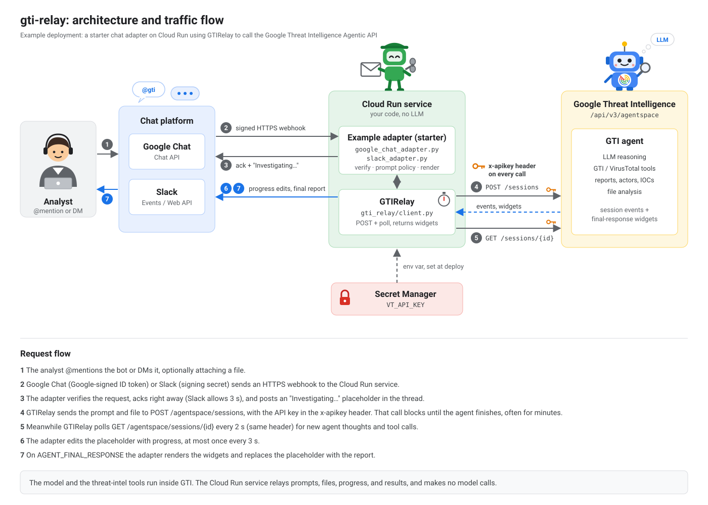

# gti-relay

A minimal Python relay for the **Google Threat Intelligence Agentic API**
(`https://www.virustotal.com/api/v3/agentspace`). The agent lives in GTI. This package is not an
agent and makes no model calls.

It sends a prompt (and optional file) to the GTI agent, streams progress while it works, and
hands you back the agent's final response as the API returned it.

Your prompt policy, your SIEM's query language, your detection-rule format, how reports look,
and which chat platform you use all live in your own adapter.

```
pip install git+https://github.com/googleSandy/gti-relay
# or: git clone https://github.com/googleSandy/gti-relay && cd gti-relay && pip install -e .
# or: copy gti_relay/client.py into your project; it's one file
```

## 30-second example

```python
import asyncio
from gti_relay import GTIRelay

async def main():
    relay = GTIRelay()                         # reads VT_API_KEY (see "Secrets" below)
    result = await relay.investigate(
        "Summarise APT29 activity in the last 90 days",
        on_progress=lambda u: print(f"[{u.elapsed_seconds:.0f}s] {u.kind}: {u.detail}"),
    )
    print(result.markdown)

asyncio.run(main())
```

```
# macOS Keychain example; see "Secrets" for other options
VT_API_KEY="$(security find-generic-password -s VT_API_KEY -w)" \
  python -m examples.cli "Deobfuscate this and explain it" --file sample.ps1

VT_API_KEY=... python -m examples.cli "What is Akira ransomware?" --raw   # dump widgets as JSON
```

## Architecture



The agent, the model, and the threat-intel tools all run inside GTI. Your service is a relay: it
forwards the prompt and file, streams progress back to the user, and renders the final widgets.
It never calls a model itself.

The API key goes from Secret Manager into the `VT_API_KEY` env var once, at deploy time. `GTIRelay`
then sends it as the `x-apikey` header on every request to GTI: the POST, the session lookup, and
each poll.

## How it works


The POST blocks for the lifetime of the investigation (often minutes). To give users live feedback,
the client runs it in the background and polls the session for events in the meantime. It uses
neither SSE nor a second LLM.

## What you get back

```python
result.status            # "COMPLETED" | "FAILED" | "TIMEOUT"
result.ok                # status == "COMPLETED"
result.session_id        # reuse via investigate(..., session_id=...) for follow-up questions
result.widgets           # list[dict] of final-response widgets, verbatim from the API
result.markdown          # all MARKDOWN_TEXT widgets joined; nothing stripped or rewritten
result.citations         # gti_citations from the markdown widgets (collections, actors, reports)
result.widgets_of_type("GRAPH")   # also "CODE", "RULE", "MITRE_ATTACK", "MARKDOWN_TEXT"
result.events            # the full raw session event log
result.tools_executed    # names from FUNCTION_CALL events
result.error             # populated on FAILED / TIMEOUT
```

Widget types and the key that holds their payload. The set varies by question, so run
`examples/cli.py --raw` to see what your prompt produced.

| `widget_type`   | payload key            | notable fields                                                      | status |
|-----------------|------------------------|---------------------------------------------------------------------|--------|
| `MARKDOWN_TEXT` | `markdown_text_widget` | `text`, `gti_citations[] {entity_type, entity_id, position}`         | verified live 2026-10 |
| `GRAPH`         | `graph_widget`         | `language` (`MERMAID`), `title`, `description`, `source`             | verified live 2026-10 |
| `MITRE_TREE`    | `mitre_tree_widget`    | `tree.tactics[] {id, name, description, link, techniques[]}`, `collection_id` | verified live 2026-10 |
| `CODE`          | `code_widget`          | `language`, `code`                                                   | seen by earlier integrations |
| `RULE`          | `rule_widget`          | `rule_content`                                                       | seen by earlier integrations |
| `MITRE_ATTACK`  | `mitre_attack_widget`  | `attack_matrix.tactics[].techniques[]`                               | seen by earlier integrations; may be superseded by `MITRE_TREE` |

## Where to customize

This package deliberately has no knobs for content. All customization happens in your adapter.
`examples/cli.py` is annotated with the same numbered markers.

| # | You want to… | Edit | Notes |
|---|--------------|------|-------|
| 1 | Enforce your SOP in every request: required sections, output format, SIEM dialect (SPL / KQL / UDM / EQL), rule format (Sigma / YARA-L / Suricata), tone, classification markings | **Your adapter** → `PROMPT_SUFFIX` / `build_prompt()` | The client sends your string verbatim. Tip: ask the agent for a fenced `json` block with named keys if you want machine-parseable sections. |
| 2 | Change how progress is shown (edit a placeholder message, log, progress bar, nothing) | **Your adapter** → `on_progress` | `ProgressUpdate.kind` is `THOUGHT` / `TOOL_CALL` / `TOOL_RESULT`; `.event` is the raw event if you need more. |
| 3 | Change how the report looks (Slack blocks, Teams Adaptive Cards, Google Chat Cards, HTML email, ticket body) | **Your adapter** → `render()` | Walk `result.widgets`. Render `GRAPH` via your own mermaid renderer or e.g. `https://mermaid.ink/img/<base64>` — your call. |
| 4 | Link IOCs/actors to your TIP, VirusTotal, or an internal portal | **Your adapter** → `render()` | Use `result.citations` (typed entity ids) rather than regex over the markdown. |
| 5 | Timeouts, poll rate, private API endpoint | `GTIRelay(timeout_seconds=, poll_interval=, base_url=)` | Defaults: 900 s, 2 s, public VT API. |
| 6 | Where the API key comes from | your deployment (see Secrets) | The client only ever reads `VT_API_KEY` (or `api_key=`). It never reads files. |
| 7 | Multi-turn conversations | `investigate(..., session_id=result.session_id)` | Posts to the existing session instead of creating one. |
| 8 | Upload a sample / script / log for analysis | `investigate(..., file=bytes, file_name="x.ps1")` | Multipart upload to the same endpoint. |
| 9 | Wire a chat platform | Google Chat / Slack: see [Example chat adapters](#example-chat-adapters-starting-points). Others: copy `examples/chat_adapter_skeleton.py` | The skeleton has three `TODO`s: post a message, edit a message, your platform's "message received" hook. |

## Example chat adapters (starting points)

> [!NOTE]
> These adapters are starter code, not finished products. They show the moving parts end to end
> so you (or your coding agent) can copy one and shape it to your SOPs, layout, and platform rules.

Both adapters run as a small FastAPI service, reply in the thread they were mentioned in, edit an
"Investigating…" placeholder with progress, and accept one file attachment. Each is a single file
meant to be copied and changed. The [`Dockerfile`](Dockerfile) builds one image for both. The
`APP` env var picks the adapter, and Google Chat is the default.

Both keep running the investigation after the webhook returns. On Cloud Run that requires
`--no-cpu-throttling`; without it the CPU is throttled after the response and investigations stall.
`--min-instances=1` keeps an instance alive for the up-to-15-minute run.

### Google Chat

[`examples/google_chat_adapter.py`](examples/google_chat_adapter.py)

1. In the Google Cloud console, open **Google Chat API > Configuration**. Set the connection to
   **HTTP endpoint URL** (your service URL) and the authentication audience to **HTTP endpoint URL**.
2. Deploy:
   ```
   gcloud run deploy gti-chat --source . \
     --set-secrets=VT_API_KEY=<vt-secret>:latest \
     --set-env-vars=CHAT_AUDIENCE=https://<service-url>/ \
     --no-cpu-throttling --min-instances=1
   ```
   You won't know the service URL until the first deploy. Deploy once, then redeploy with the real
   `CHAT_AUDIENCE`.
3. Add the app to a space and @mention it, or DM it.

The adapter rejects any request without a Google-signed ID token issued by
`chat@system.gserviceaccount.com` for `CHAT_AUDIENCE`. It posts and edits messages through the
Chat API using the Cloud Run service account.

### Slack

[`examples/slack_adapter.py`](examples/slack_adapter.py)

1. Create an app at api.slack.com/apps. Bot token scopes: `app_mentions:read`, `chat:write`,
   `files:read`, `im:history`.
2. Store the bot token and signing secret in Secret Manager, then deploy (replace the `<…>` names
   with your secrets' names):
   ```
   gcloud run deploy gti-slack --source . \
     --set-secrets=VT_API_KEY=<vt-secret>:latest,SLACK_BOT_TOKEN=<slack-token-secret>:latest,SLACK_SIGNING_SECRET=<slack-signing-secret>:latest \
     --set-env-vars=APP=examples.slack_adapter:api \
     --no-cpu-throttling --min-instances=1
   ```
3. Under **Event Subscriptions**, set the request URL to `https://<service-url>/slack/events` and
   subscribe to the `app_mention` and `message.im` bot events. Install the app to your workspace.

Bolt checks the Slack signature and acks within Slack's 3-second limit before the investigation starts.

Both adapters render markdown, MITRE tactics, and mermaid source as plain text. Swap `render()`
for Cards V2 or Block Kit when you want richer layout.

You should not need to edit `gti_relay/client.py`. If you find yourself doing so, it's probably
an API change, so please open an issue.

## Secrets

The GTI/VirusTotal API key is a credential with billing and data-access consequences. This package
reads it from the `VT_API_KEY` environment variable (or `GTIRelay(api_key=...)`) and nothing else:
no `.env` files, no config files, no keyring lookups. Inject it from wherever your organisation keeps
secrets:

| Context | How to get it into `VT_API_KEY` |
|---|---|
| Google Cloud Run / Functions | `gcloud run deploy … --set-secrets=VT_API_KEY=<vt-secret>:latest`. The left side is the env var the code reads; `<vt-secret>` is whatever you named the secret in Secret Manager. |
| AWS Lambda / ECS | Secrets Manager → task definition `secrets:` / Lambda env from Parameter Store |
| Kubernetes | `envFrom: secretRef` backed by External Secrets / Vault Agent |
| CI (GitHub Actions, Cloud Build) | repository / project secret → `env: VT_API_KEY: ${{ secrets.GTI_API_KEY }}` |
| Local dev (macOS) | `security add-generic-password -s VT_API_KEY -a "$USER" -w` once, then `VT_API_KEY="$(security find-generic-password -s VT_API_KEY -w)" python …` |
| Local dev (1Password / Bitwarden) | `op run --env-file=<(echo 'VT_API_KEY=op://vault/gti/credential') -- python …` |
| Local dev (any) | `read -s VT_API_KEY && export VT_API_KEY` (never echoes, never persists) |

> Do not commit `.env` files, and do not paste keys into chat tools or tickets. If a key is exposed,
> rotate it at https://www.virustotal.com/gui/my-apikey.

## Customizing with a coding agent

The repo is laid out so a coding agent (Antigravity, Gemini CLI, Claude Code, Codex, Cursor) can
pick it up and tailor it without breaking the core:

* [`AGENTS.md`](AGENTS.md) holds the rules: what the project is, which files to edit, what not to
  touch, and how to verify a change. `CLAUDE.md` and `GEMINI.md` point to it.
* `gti_relay/client.py` is the stable core. Adapters in `examples/` are meant to be copied and changed.
* Every customization point is a numbered `# CUSTOMIZE n` comment that matches the table in
  [Where to customize](#where-to-customize).
* `pytest` runs offline with a mocked API, so the agent can check its own work.

Example prompt:

```
Read AGENTS.md. Copy examples/slack_adapter.py to adapters/soc_slack.py. Make every request end with
our SOP: an executive summary, IOCs as a table, and a Splunk SPL hunt query. Render the report as
Block Kit. Add tests for render(), then run pytest.
```

## Project layout

```
AGENTS.md                    instructions for coding agents (CLAUDE.md, GEMINI.md point here)
gti_relay/
  client.py                  the entire library (~250 lines, httpx only)
examples/
  cli.py                     terminal adapter with CUSTOMIZE markers
  google_chat_adapter.py     Google Chat app (FastAPI, Chat API)
  slack_adapter.py           Slack app (Bolt, FastAPI)
  chat_adapter_skeleton.py   platform-agnostic chat adapter template
docs/
  architecture.svg           architecture and traffic-flow diagram
Dockerfile                   one image for both chat adapters (APP selects which)
tests/
  test_client.py             mocks the HTTP API; no key or network needed
  test_adapters.py           render/markup/split helpers of the example adapters
```

## Development

```
python -m venv .venv && . .venv/bin/activate
pip install -e ".[dev,chat,slack]"
pytest
```

## Related
* GTI Agentic API docs: https://gtidocs.virustotal.com/

## License

MIT
